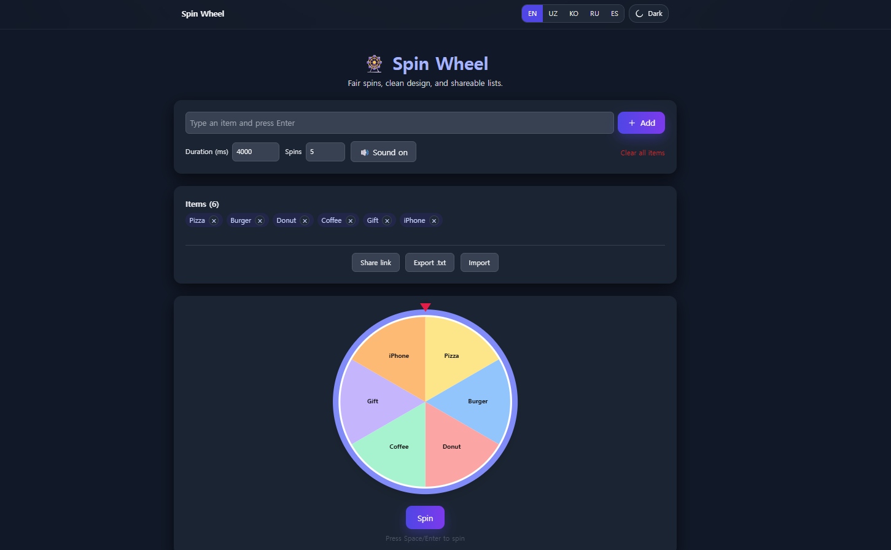

# 🎡 커스텀 스핀 휠

[🇺🇸 English README](./README.md)

**React**로 제작된 커스터마이징 가능한 스핀 휠 게임입니다.  
원하는 항목을 직접 추가하고, 부드러운 애니메이션과 사운드 효과를 경험할 수 있으며, 당첨 결과에 따른 재미있는 정보도 제공합니다.  
**Vite**와 **Tailwind CSS**로 빌드하여 빠르고 반응형 UI를 제공합니다.

## 🧠 기능

- 원하는 항목 실시간 추가
- 부드러운 회전 애니메이션 및 사운드 효과
- 당첨 항목별 재미있는 정보 표시
- 결과 기록 및 삭제 기능
- 모바일/데스크탑 완전 반응형
- **Vite** 기반 빠른 개발 환경
- **Tailwind CSS** 유틸리티 클래스 스타일링

## 📸 미리보기



## 🚀 시작하기

### 사전 준비

- **Node.js**와 **npm**이 설치되어 있어야 합니다.

### 설치 방법

```bash
git clone https://github.com/DevFayzullo/spin-wheel.git
cd spin-wheel
npm install
```

### 개발 모드 실행

```bash
npm run dev
```

## 🌐 라이브 데모

<!-- 👉 [라이브 데모 보러가기](https://DevFayzullo.github.io/spin-wheel) -->

## 🛠️ 기술 스택

- **React 19**
- **Vite**
- **Tailwind CSS 4**
- **JavaScript (ES6+)**
- **ESLint**
- **gh-pages** (배포용)

## 📄 라이선스

이 프로젝트는 **MIT License**를 따릅니다.

---

📌 제작: **Your Name**

> “운은 준비와 기회가 만날 때 생긴다.” – 세네카

행운을 돌려보세요! 🎯
