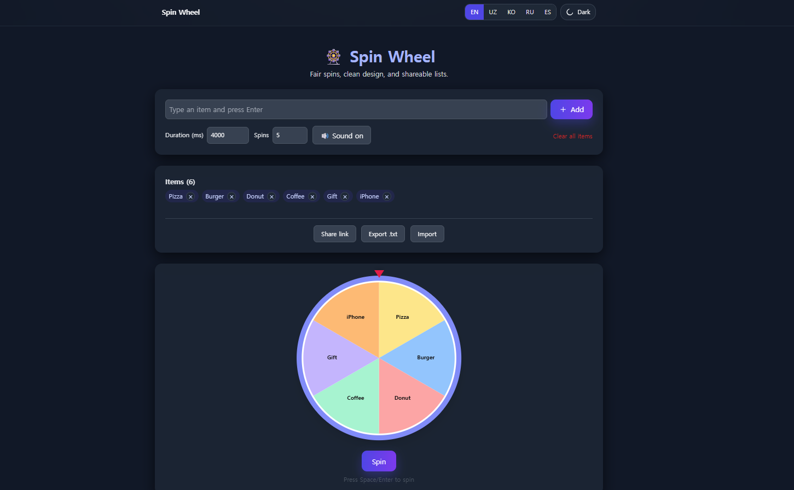

# 🎡 Custom Spin Wheel

[🇰🇷 한국어 README](./README.kr.md)

A **React-based** customizable spin wheel game with dynamic items, smooth animations, and fun facts.  
Built with **Vite** and styled using **Tailwind CSS**, this project delivers a premium, responsive, and engaging experience — perfect for portfolios, games, and frontend practice.

## 🧠 Features

- Add custom items dynamically
- Smooth spinning animation with sound effect
- Fun facts for each winning item
- Result history with clear option
- Fully responsive (mobile & desktop)
- Built with **Vite** for fast development
- Styled with **Tailwind CSS** utility-first classes

<!-- ## 📸 Preview

 -->

## 🚀 Getting Started

### Prerequisites

- **Node.js** and **npm** installed on your machine

### Installation

```bash
git clone https://github.com/DevFayzullo/spin-wheel.git
cd spin-wheel
npm install
```

### Run in Development Mode

```bash
npm run dev
```

## 🌐 Live Demo

👉 [Click here to view the live demo](https://DevFayzullo.github.io/spin-wheel)

## 🛠️ Tech Stack

- **React 19**
- **Vite**
- **Tailwind CSS 4**
- **JavaScript (ES6+)**
- **ESLint**
- **gh-pages** (for deployment)

## 📄 License

This project is licensed under the **MIT License**.

---

📌 Developed by **DevFayzullo**

> “Luck is what happens when preparation meets opportunity.” – Seneca

Spin and win! 🎯
